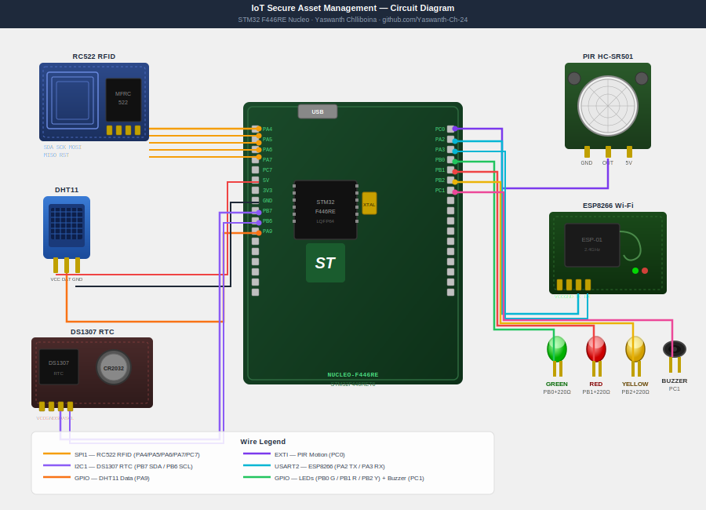

# IoT-Enabled Secure Asset Management & Environmental Monitoring System

> **STM32 F446RE (Nucleo-F446RE) | Embedded C | HAL Library | 2026**
> RFID-based access control + PIR motion detection + DHT11 environmental sensing + DS1307 RTC timestamped logging over Wi-Fi — all running on STM32 F446RE.

---

## 📌 Board: STM32 F446RE (Nucleo-F446RE)

| Detail | Value |
|---|---|
| MCU | STM32F446RET6 |
| Core | ARM Cortex-M4 @ 180 MHz |
| Flash | 512 KB |
| RAM | 128 KB SRAM |
| Board | NUCLEO-F446RE |
| IDE | STM32CubeIDE 1.14+ |
| HAL | STM32 HAL (generated via CubeMX) |
| Debugger | ST-Link V2 (on-board) |

---

## 🔍 Project Overview

A complete **IoT security and environmental monitoring gateway** built on the STM32 F446RE Nucleo board. The system authenticates users via RFID, detects unauthorized motion via PIR, monitors temperature/humidity via DHT11, timestamps every event with DS1307 RTC, and sends all logs to a PC terminal over UART — simulating a real industrial asset management system.

---

## ⚡ Features

| Feature | Hardware | STM32 Interface |
|---|---|---|
| RFID Access Control | RC522 | SPI1 |
| Motion Detection | HC-SR501 PIR | GPIO (EXTI interrupt) |
| Temp + Humidity | DHT11 | GPIO (bit-bang) |
| Real-Time Clock | DS1307 | I2C1 |
| Wi-Fi / Serial Log | ESP8266 | USART2 |
| Status LEDs | 3x LEDs | GPIO Output |
| Buzzer Alert | Passive buzzer | GPIO Output |
| Debug Terminal | USB-UART | USART1 (ST-Link) |

---

## 🔌 Pin Connections (STM32 F446RE Nucleo)

### RC522 RFID — SPI1

| RC522 Pin | STM32 Pin | Nucleo Label |
|---|---|---|
| SDA (CS) | PA4 | CN7-17 |
| SCK | PA5 | CN10-11 (Arduino D13) |
| MOSI | PA7 | CN10-15 (Arduino D11) |
| MISO | PA6 | CN10-13 (Arduino D12) |
| RST | PC7 | CN10-19 (Arduino D9) |
| VCC | 3.3V | CN6-4 |
| GND | GND | CN6-6 |

### DS1307 RTC — I2C1

| DS1307 Pin | STM32 Pin | Nucleo Label |
|---|---|---|
| SDA | PB7 | CN7-21 |
| SCL | PB6 | CN10-17 |
| VCC | 5V | CN6-5 |
| GND | GND | CN6-6 |

### DHT11 Temperature/Humidity — GPIO

| DHT11 Pin | STM32 Pin | Nucleo Label |
|---|---|---|
| DATA | PA9 | CN10-21 (Arduino D8) |
| VCC | 3.3V | CN6-4 |
| GND | GND | CN6-6 |

### HC-SR501 PIR Motion — GPIO EXTI

| PIR Pin | STM32 Pin | Nucleo Label |
|---|---|---|
| OUT | PC0 | CN7-35 |
| VCC | 5V | CN6-5 |
| GND | GND | CN6-6 |

### ESP8266 Wi-Fi — USART2

| ESP8266 Pin | STM32 Pin | Nucleo Label |
|---|---|---|
| TX | PA3 (USART2_RX) | CN10-37 |
| RX | PA2 (USART2_TX) | CN10-35 |
| VCC | 3.3V | CN6-4 |
| GND | GND | CN6-6 |

### LEDs and Buzzer — GPIO Output

| Component | STM32 Pin | Nucleo Label |
|---|---|---|
| Green LED (Access OK) | PB0 | CN10-31 |
| Red LED (Access Denied) | PB1 | CN10-24 |
| Yellow LED (Motion) | PB2 | CN10-22 |
| Buzzer | PC1 | CN7-36 |

---

## 🔌 Circuit Diagram



> Full wiring guide in [docs/quick_start.md](docs/quick_start.md)

## 📁 Repository Structure

```text
iot-secure-asset-monitoring/
├── Core/
│   ├── Inc/
│   │   ├── main.h
│   │   ├── rc522.h
│   │   ├── dht11.h
│   │   ├── ds1307.h
│   │   └── access_control.h
│   └── Src/
│       ├── main.c
│       ├── rc522.c
│       ├── dht11.c
│       ├── ds1307.c
│       └── access_control.c
├── simulator/
│   └── simulate.py
└── README.md
```

---

## 🚀 How to Run

### Option A — Simulate on PC (No hardware needed)

```bash
cd simulator
python simulate.py
```

This runs a full terminal simulation — RFID scan, access grant/deny, motion alerts, and environmental readings.

### Option B — Flash to STM32 F446RE Nucleo

1. Install **STM32CubeIDE** from [st.com](https://www.st.com/en/development-tools/stm32cubeide.html)
2. Open STM32CubeIDE → File → Import → Existing Project → select this folder
3. Connect Nucleo board via USB
4. Click **Run** (F11) — ST-Link flashes automatically
5. Open Serial Monitor at **115200 baud** to see logs

### Option C — Use pre-built binary

Flash the `.bin` file in `/binary/` using STM32CubeProgrammer.

---

## 📊 Sample Output (UART Terminal @ 115200 baud)

```text
=========================================
  IoT Asset Management System
  STM32 F446RE | Yaswanth Chlliboina
=========================================
[2026-03-15 09:30:00] System initialized
[2026-03-15 09:30:01] DHT11: Temp=28.5C  Humidity=65%
[2026-03-15 09:32:14] RFID scan detected...
[2026-03-15 09:32:14] Card UID: A3 F2 B1 09
[2026-03-15 09:32:14] ACCESS GRANTED  >> Green LED ON
[2026-03-15 09:32:14] Log sent to server via ESP8266
[2026-03-15 09:45:02] PIR: MOTION DETECTED >> Yellow LED ON >> Buzzer ON
[2026-03-15 10:01:55] ACCESS DENIED   >> Red LED ON >> Buzzer ON
```

---

## 👤 Author

Chlliboina Yaswanth

B.Tech Electrical and Electronics Engineering | CGPA: 8.56

Dr. Lankapalli Bullayya College of Engineering, Visakhapatnam

- Email: [yaswanth2452005@gmail.com](mailto:yaswanth2452005@gmail.com)
- LinkedIn: [yaswanth-chlliboina](https://www.linkedin.com/in/yaswanth-chlliboina/)
- GitHub: [Yaswanth-Ch-24](https://github.com/Yaswanth-Ch-24)
